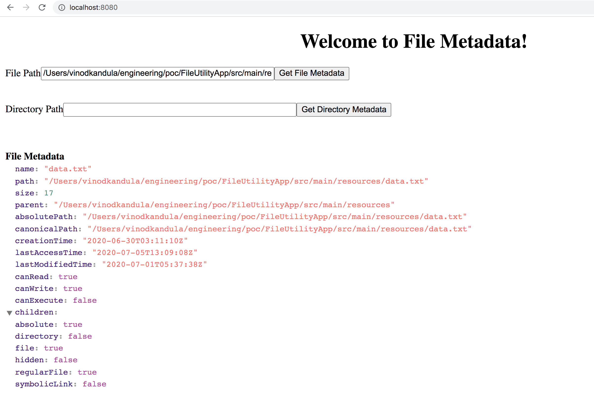
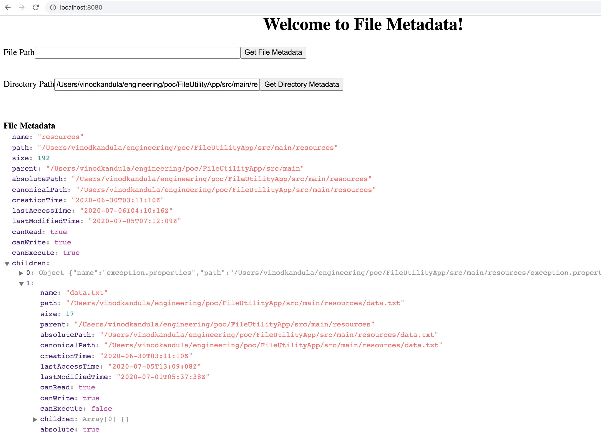
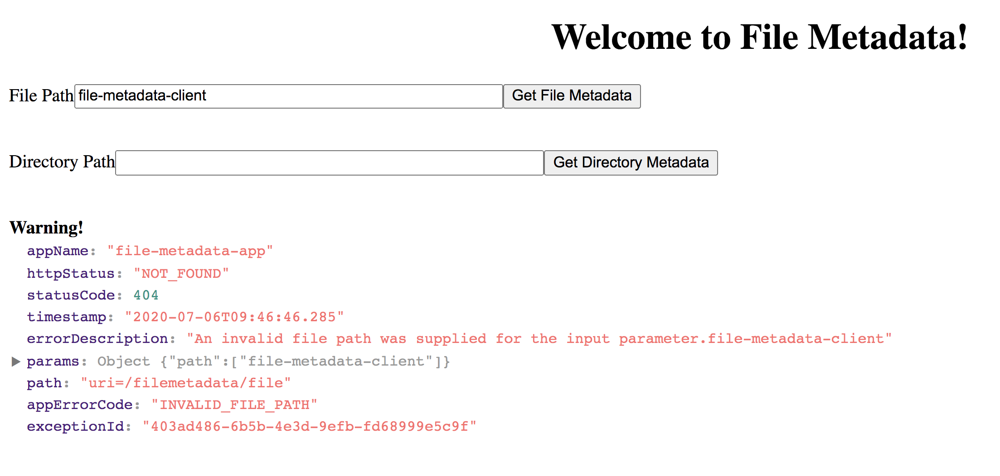

# File Metadata App
Write a service/utility which returns the information about files in a specific directory. The service should provide 2 methods:

Method 1: Given a full path to a directory as a parameter, return an XML\JSON that contains description of all the files and directories (recursively) under the one given as the parameter. The description must include a full path, size and a flag if the entry is a directory or a file.

Method 2: Given a full path to a file as a parameter, return an XML\JSON that contains a full description of that file . The description must include a full path and all of the attributes available in the JDK for a file object (e.g. read, write, execute, etc.)


## Build
#### Build & Unit Tests
```
mvn clean install
```

## Running File Metadata App
```
mvn spring-boot:run
```

## API Reference
```
GET /filemetadata/file?path=<>
GET /filemetadata/directory?path=<>
```
## API Reference Examples
```
GET
curl http://localhost:8080/filemetadata/file?path=/Users/vinodkandula/engineering/poc/FileUtilityApp/src/main/resources/data.txt

Response
{
  "name" : "data.txt",
  "path" : "/Users/vinodkandula/engineering/poc/FileUtilityApp/src/main/resources/data.txt",
  "size" : 17,
  "parent" : "/Users/vinodkandula/engineering/poc/FileUtilityApp/src/main/resources",
  "absolutePath" : "/Users/vinodkandula/engineering/poc/FileUtilityApp/src/main/resources/data.txt",
  "canonicalPath" : "/Users/vinodkandula/engineering/poc/FileUtilityApp/src/main/resources/data.txt",
  "creationTime" : "2020-06-30T03:11:10Z",
  "lastAccessTime" : "2020-07-05T13:09:08Z",
  "lastModifiedTime" : "2020-07-01T05:37:38Z",
  "canRead" : true,
  "canWrite" : true,
  "canExecute" : false,
  "children" : [ ],
  "absolute" : true,
  "directory" : false,
  "file" : true,
  "hidden" : false,
  "regularFile" : true,
  "symbolicLink" : false
}

```
```
GET
curl http://localhost:8080/filemetadata/directory?path=/Users/vinodkandula/engineering/poc/FileUtilityApp/src/main/resources/

Response
{
  "name" : "resources",
  "path" : "/Users/vinodkandula/engineering/poc/FileUtilityApp/src/main/resources",
  "size" : 192,
  "parent" : "/Users/vinodkandula/engineering/poc/FileUtilityApp/src/main",
  "absolutePath" : "/Users/vinodkandula/engineering/poc/FileUtilityApp/src/main/resources",
  "canonicalPath" : "/Users/vinodkandula/engineering/poc/FileUtilityApp/src/main/resources",
  "creationTime" : "2020-06-30T03:11:10Z",
  "lastAccessTime" : "2020-07-05T15:52:50Z",
  "lastModifiedTime" : "2020-07-05T07:12:09Z",
  "canRead" : true,
  "canWrite" : true,
  "canExecute" : true,
  "children" : [ {
    "name" : "exception.properties",
    "path" : "/Users/vinodkandula/engineering/poc/FileUtilityApp/src/main/resources/exception.properties",
    "size" : 483,
    "parent" : "/Users/vinodkandula/engineering/poc/FileUtilityApp/src/main/resources",
    "absolutePath" : "/Users/vinodkandula/engineering/poc/FileUtilityApp/src/main/resources/exception.properties",
    "canonicalPath" : "/Users/vinodkandula/engineering/poc/FileUtilityApp/src/main/resources/exception.properties",
    "creationTime" : "2019-05-17T05:51:33Z",
    "lastAccessTime" : "2020-07-05T13:09:08Z",
    "lastModifiedTime" : "2020-07-05T05:36:20Z",
    "canRead" : true,
    "canWrite" : true,
    "canExecute" : false,
    "children" : [ ],
    "absolute" : true,
    "directory" : false,
    "file" : true,
    "hidden" : false,
    "regularFile" : true,
    "symbolicLink" : false
  }, {
    "name" : "data.txt",
    "path" : "/Users/vinodkandula/engineering/poc/FileUtilityApp/src/main/resources/data.txt",
    "size" : 17,
    "parent" : "/Users/vinodkandula/engineering/poc/FileUtilityApp/src/main/resources",
    "absolutePath" : "/Users/vinodkandula/engineering/poc/FileUtilityApp/src/main/resources/data.txt",
    "canonicalPath" : "/Users/vinodkandula/engineering/poc/FileUtilityApp/src/main/resources/data.txt",
    "creationTime" : "2020-06-30T03:11:10Z",
    "lastAccessTime" : "2020-07-05T13:09:08Z",
    "lastModifiedTime" : "2020-07-01T05:37:38Z",
    "canRead" : true,
    "canWrite" : true,
    "canExecute" : false,
    "children" : [ ],
    "absolute" : true,
    "directory" : false,
    "file" : true,
    "hidden" : false,
    "regularFile" : true,
    "symbolicLink" : false
  }, {
    "name" : "exception-common.properties",
    "path" : "/Users/vinodkandula/engineering/poc/FileUtilityApp/src/main/resources/exception-common.properties",
    "size" : 743,
    "parent" : "/Users/vinodkandula/engineering/poc/FileUtilityApp/src/main/resources",
    "absolutePath" : "/Users/vinodkandula/engineering/poc/FileUtilityApp/src/main/resources/exception-common.properties",
    "canonicalPath" : "/Users/vinodkandula/engineering/poc/FileUtilityApp/src/main/resources/exception-common.properties",
    "creationTime" : "2019-04-17T07:12:49Z",
    "lastAccessTime" : "2020-07-05T13:09:08Z",
    "lastModifiedTime" : "2019-04-17T07:12:49Z",
    "canRead" : true,
    "canWrite" : true,
    "canExecute" : false,
    "children" : [ ],
    "absolute" : true,
    "directory" : false,
    "file" : true,
    "hidden" : false,
    "regularFile" : true,
    "symbolicLink" : false
  }, {
    "name" : "application.properties",
    "path" : "/Users/vinodkandula/engineering/poc/FileUtilityApp/src/main/resources/application.properties",
    "size" : 79,
    "parent" : "/Users/vinodkandula/engineering/poc/FileUtilityApp/src/main/resources",
    "absolutePath" : "/Users/vinodkandula/engineering/poc/FileUtilityApp/src/main/resources/application.properties",
    "canonicalPath" : "/Users/vinodkandula/engineering/poc/FileUtilityApp/src/main/resources/application.properties",
    "creationTime" : "2020-06-30T03:11:10Z",
    "lastAccessTime" : "2020-07-05T15:51:31Z",
    "lastModifiedTime" : "2020-07-05T02:34:41Z",
    "canRead" : true,
    "canWrite" : true,
    "canExecute" : false,
    "children" : [ ],
    "absolute" : true,
    "directory" : false,
    "file" : true,
    "hidden" : false,
    "regularFile" : true,
    "symbolicLink" : false
  } ],
  "absolute" : true,
  "directory" : true,
  "file" : false,
  "hidden" : false,
  "regularFile" : false,
  "symbolicLink" : false
}
```
```
GET
curl http://localhost:8080/filemetadata/file?path=/Users/vinodkandula/engineering/poc/FileUtilityApp/src/main/resources/nofile.txt

Response
{
"appName": "file-metadata-app",
"httpStatus": "NOT_FOUND",
"statusCode": 404,
"timestamp": "2020-07-05T21:33:25.107",
"errorDescription": "An invalid file path was supplied for the input parameter./Users/vinodkandula/engineering/poc/FileUtilityApp/src/main/resources/nofile.txt",
"params": {
"path": [
  "/Users/vinodkandula/engineering/poc/FileUtilityApp/src/main/resources/nofile.txt"
],
},
"path": "uri=/filemetadata/file",
"appErrorCode": "INVALID_FILE_PATH",
"exceptionId": "1960cde5-3a7e-436b-85e7-d87a3f0405e8"
}

```

## Angular UI - File Metadata


## Angular UI - Directory Metadata


## Angular UI - Error
